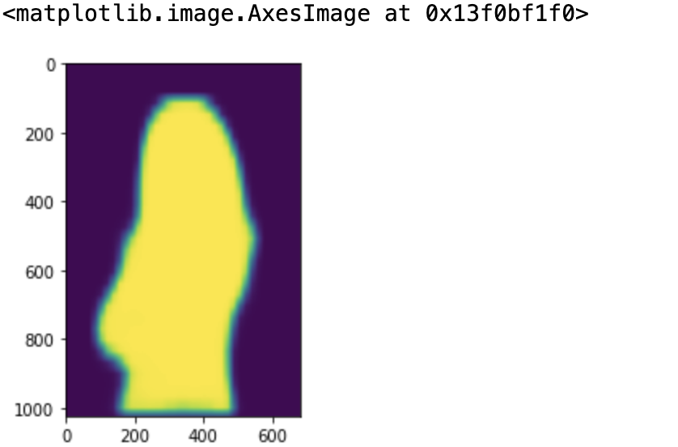

# Emulating-Portrait-Bokeh-Effect
Emulating bokeh effect using a pretrained machine learning model.

Removing the subject from the image using a pretrained model to retrieve the subject mask. 
Then applying a blur to the background of the image and stitching them back together.  

Original Image  

Subject Mask  

Final Result  

